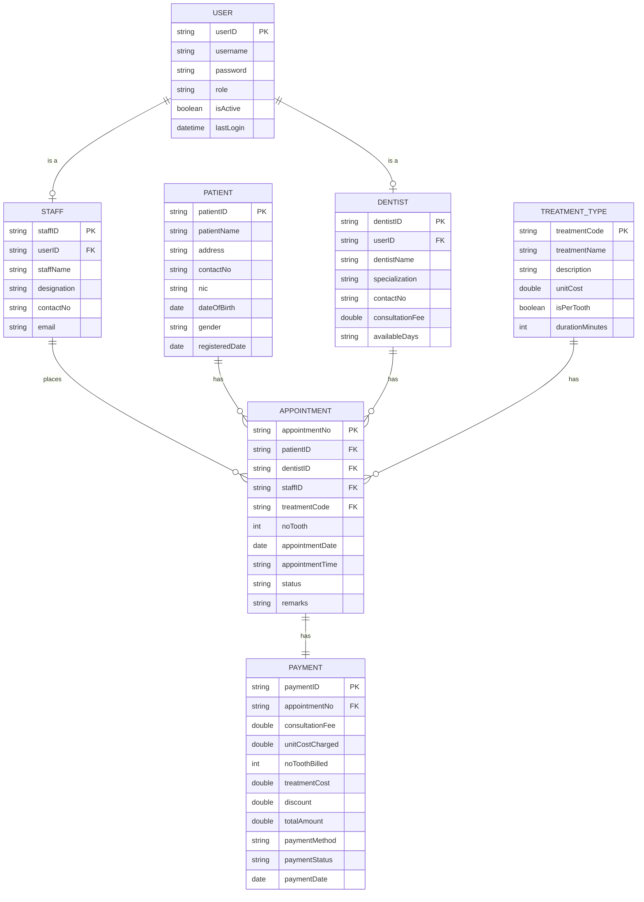

# Entity Relationship Diagram

Sunrise Dental Clinic — Appointment and Patient Management System

## Relational schema

## Cardinality and participation

| Relationship | Ratio | Participation | Reason |
|---|---|---|---|
| `USER` is a `STAFF` | 1 : 1 | Partial, disjoint | A login is either a staff account or a dentist account, not both |
| `USER` is a `DENTIST` | 1 : 1 | Partial, disjoint | Same idea as above |
| `STAFF` places `APPOINTMENT` | 1 : M | Total on appointment | Whoever books it gets recorded, mainly so there's a trail if something needs checking later |
| `PATIENT` has `APPOINTMENT` | 1 : M | Total on appointment | Patients come back for more than one visit |
| `DENTIST` has `APPOINTMENT` | 1 : M | Total on appointment | One dentist, many patients over time |
| `TREATMENT_TYPE` has `APPOINTMENT` | 1 : M | Total on appointment | Falls back to `Checking` if nothing else is picked, so it's never left blank |
| `APPOINTMENT` has `PAYMENT` | 1 : 1 | Total both sides | Every visit ends with a bill |

## Derived attributes

A few fields aren't stored anywhere — they're just worked out in code when needed:

- `PATIENT.age` from `dateOfBirth`
- `APPOINTMENT.endTime` from `appointmentTime` plus `durationMinutes × noTooth`
- `PAYMENT.treatmentCost` from `unitCost × noTooth` if `isPerTooth`, otherwise just `unitCost`
- `PAYMENT.totalAmount` from `consultationFee + treatmentCost − discount`

## Design notes

`TREATMENT_TYPE` got pulled out into its own table so there's one place that
holds the price list. If it wasn't separate, the cost would need to be typed in
by hand on every single appointment, and that's basically how the billing
mistakes this whole system is supposed to fix would keep happening.

`isPerTooth` sits on `TREATMENT_TYPE` because it's really about the treatment
itself, not any one visit — filling is always per-tooth, a checkup never is.
`noTooth`, on the other hand, is about what happened on a specific visit, so it
lives on `APPOINTMENT`. For treatments where `isPerTooth` is false, `noTooth`
just gets set to `1` — that way the cost formula still works without having to
special-case it.

`PAYMENT` keeps its own copies of `consultationFee`, `unitCostCharged` and
`noToothBilled` instead of pulling them from `TREATMENT_TYPE`/`DENTIST` at
read time. It looks redundant, but it's on purpose — prices change over time,
and an old receipt still needs to show the numbers that were actually charged
on that day, not whatever the price list says now. Keeping the pieces
separate also means the receipt can show the working (fee + cost − discount),
not just a final total nobody can double-check.
