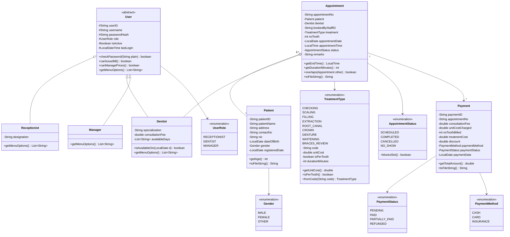
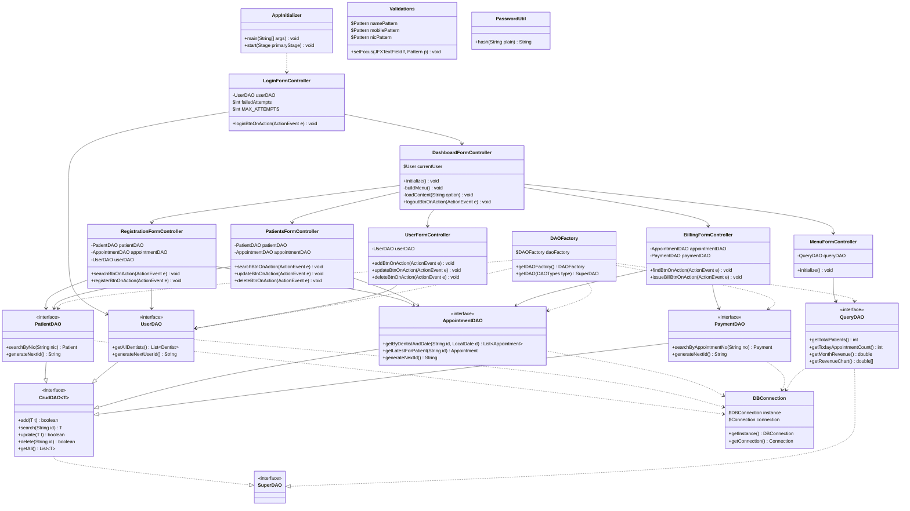

# Class Diagram

Sunrise Dental Clinic — Appointment and Patient Management System

This is split into two figures rather than one. All twenty classes on a single
page turns into an unreadable mess once it's scaled down to fit A4, so it's cut
along the seam that was already there anyway: the domain side (what the system
actually knows about — patients, appointments, payments) and the application
side (how the code itself is put together — controllers, DAOs, the JDBC
persistence layer). They're still one class diagram for the report, just
captioned as Figure 2a and 2b.

---

## 1. Figure 2a — Domain model

---

## 2. Figure 2b — Application architecture

---

## 3. Design decisions

**Three layers: Model, DAO, Controller/View (MVC), no separate service layer.**
The JavaFX FXML controllers only handle input/output and wiring buttons to
actions; the actual business rules — clash detection, bill calculation, age,
menu options per role — live as methods directly on the `model` classes
(`Appointment.overlaps()`, `Payment.getTotalAmount()`, `Patient.getAge()`,
`User.getMenuOptions()`); and the `dao` classes deal with the database. There's
no `bo`/DTO split and no `Service` layer sitting between them — the model
carries both the data and the behaviour that would otherwise live in a
service object, so a controller can call `appointmentDAO.getByDentistAndDate(...)`
and then `appointment.overlaps(other)` directly. If SQL lived inside the
controllers instead, the clash-detection logic and the billing formula would
end up buried among `Alert` dialogs — impossible to test on their own and
awkward to reuse.

**`User` is abstract, with three subclasses hanging off it.** The ER model
already treats this as an "is a" relationship, so inheritance is the obvious
fit in Java. The real payoff is `getMenuOptions()` — each subclass overrides
it, so instead of a pile of `if (role.equals("MANAGER"))` checks scattered
through the menu code, `DashboardFormController` just asks
`currentUser.getMenuOptions()` for the sidebar buttons and lets polymorphism
sort it out. If a fourth role ever gets added, that's one new subclass,
`DashboardFormController` doesn't change at all.

**`CrudDAO<T>` is a generic interface, and every custom DAO is built from a
singleton `DAOFactory` with an enum switch.** Hard-coding `new PatientDAOImpl()`
straight into every controller would scatter the choice of implementation
across the whole codebase. Coding against `CrudDAO<T>`/`SuperDAO` instead means
swapping JDBC for something else later is a new set of DAO implementations,
not a rewrite of the controllers that use them — the same reasoning the
brief's own text-file design used for `Repository<T>`, just aimed at a JDBC
persistence layer instead. `DAOFactory.getDAOFactory().getDAO(DAOTypes.PATIENT)`
is the one place that knows which concrete class backs which DAO type, so
adding a new DAO is one enum constant and one switch case, not a hunt through
every controller that needs one.

**`DBConnection` is a lazily-initialised singleton wrapping one `java.sql.Connection`.**
Every DAO implementation asks `DBConnection.getInstance().getConnection()` for
the same open connection rather than opening its own, which is both simpler
and cheaper than reconnecting per query — and it's the same "singleton
wrapping the underlying resource" shape the rest of the application already
uses for `DAOFactory`.

**`Appointment` aggregates `Patient` and `Dentist` rather than composing them.**
A patient still exists whether or not they have an appointment, and cancelling
one doesn't erase the patient — their lifetimes aren't tied together, so a
hollow diamond fits better than a filled one.

**Six enums instead of plain `String` fields.** Every one of these attributes
only ever takes a handful of legal values. Leave it as a `String` and a typo
like `"Cancelled"` vs `"CANCELLED"` compiles fine and just breaks quietly at
runtime — worse, a bad treatment name could get written straight into a data
file and stay there. With an enum the compiler catches it, and `switch`
statements over the type are exhaustive. `TreatmentType` also carries the
cost, the per-tooth flag, and the duration, so pricing lives in exactly one
place. `AppointmentStatus.blocksSlot()` only returns true for `SCHEDULED`,
which is how a cancelled appointment frees up its slot again without any
special case in the clash checker.

**Searching by appointment number is a query, not an in-memory lookup.**
`AppointmentDAO.search(appointmentNo)` runs a `SELECT ... WHERE appointment_no=?`
against the primary key, and MySQL's own index does the O(1)-ish work an
in-memory `HashMap` would have done in the text-file design. There's no
Java-side cache to keep in sync with the database, which also means two
receptionists on different machines both see the same data immediately.

**`getAge()`, `getEndTime()` and `getTotalAmount()` are methods, not fields.**
All three can be worked out from data that's already there, so storing them
separately would just be an invitation for them to drift — a stored age is
wrong within a year, a stored end time is wrong the moment the treatment
changes, a stored total can end up not matching its own components.
Calculating on demand just removes the possibility of that mismatch.

**`Payment` copies its figures instead of pointing back at them.**
`consultationFee`, `unitCostCharged` and `noToothBilled` get copied in at the
moment the bill is raised, rather than read live off `Dentist` and
`TreatmentType`. It looks like duplication, and it is, but it's deliberate —
a receipt has to print exactly the same next year even after the clinic's
prices change, and keeping the components around lets it show the actual
arithmetic instead of a total nobody can check.

**`util.Validations` is its own class, holding every regex pattern plus a
`setFocus(JFXTextField, Pattern)` helper that colours a field's border red or
blue as the user types.** Every input screen needs the same validation, and
the tooth-count field specifically has to be disabled whenever the selected
treatment isn't per-tooth. Putting the patterns in one place keeps the rules
consistent across `registration_form`, `patients_form` and `user_form`
instead of being written slightly differently on every screen.

**`Appointment` stores `bookedByStaffID` as a plain string, not a `Staff`
object.** It's only there for the audit trail — recording who took the
booking. Holding a full reference would mean `AppointmentDAO` has to join in
and reconstruct a whole `Receptionist` on every read, and it's no real benefit
when the ID alone is enough to trace it back to them.

---

## 4. Assumptions relevant to this diagram

| # | Assumption | Why |
|---|---|---|
| 1 | Login credentials are stored as hashes, not plain text | A readable credentials file would hand over access to patients' health records to anyone who opens it |
| 2 | One appointment has exactly one treatment type | Keeps the model a simple 1:M; a patient needing two procedures just books two appointments, which is how the slots would actually get scheduled anyway |
| 3 | `CHECKING` is the default treatment type, and it's free | Means the treatment field is never left null — book an appointment without picking a treatment and it's just recorded as a consultation |
| 4 | Total = consultation fee + treatment cost − discount | This is what the brief actually says (cost based on treatment type and consultation fee), so the fee never gets folded into the treatment cost itself |
| 5 | Some treatments are priced per tooth | Pulling three teeth obviously can't cost the same as pulling one; `isPerTooth` on the enum plus `noTooth` on the appointment covers this without repeating price data anywhere |
| 6 | Tooth count has to be between 1 and 32 | An adult mouth has 32 teeth, so anything above that is a typo, not a real number, and would badly overcharge someone |
| 7 | Every screen reads/writes straight through JDBC, nothing is cached in memory | A crash only ever loses the one operation in progress, since every add/update/delete is its own committed statement rather than a snapshot flushed at exit |
| 8 | Dates are kept as `LocalDate` internally, shown as `dd/MM/yyyy` | Storing them this way keeps sorting correct; showing them this way matches how dates are normally written in Sri Lanka |
| 9 | Appointment numbers are generated, never typed in | The brief calls for a unique number per visit — letting staff type their own just invites duplicates |

---

## 5. Figure captions for the report

> **Figure 2a** — Domain model: the abstract `User` class and its three
> subclasses, the `Patient`, `Appointment` and `Payment` entities, and the six
> enums that keep their attributes to a fixed set of values.

> **Figure 2b** — Application architecture: the JavaFX controller/view layer,
> the model layer carrying the business-rule methods, and the generic
> `CrudDAO<T>`/`DAOFactory` pair backing a JDBC persistence layer.
