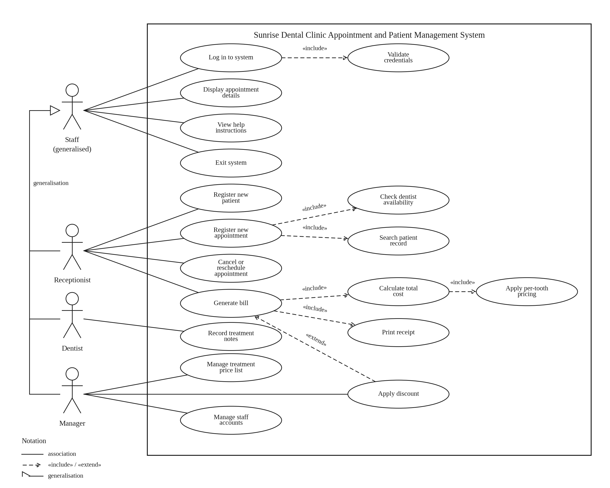

# Software Requirements Specification

**Sunrise Dental Clinic — Appointment and Patient Management System**

Version 1.0 · Prepared as a companion to `ERD.md`, `ClassDiagram.md`,
`SequenceDiagrams.md`, and `TestPlan.md`, which this document links to
rather than repeats in full.

**Repository:** [github.com/DasunMadawa/sun-rise-dental-clinic](https://github.com/DasunMadawa/sun-rise-dental-clinic)

---

## 1. Introduction

### 1.1 Purpose

This document specifies what Sunrise Dental Clinic's management system
does, how it is put together, why it is put together that way, and how it
has been verified. It exists as a single reference someone who has never
opened the codebase can read to understand the whole system — a supervisor,
a reviewer, or a future maintainer.

### 1.2 Scope

The system replaces a clinic's manual, paper/spreadsheet-based process for:

- registering patients and booking appointments (with double-booking
  prevention),
- billing a completed appointment and printing/emailing a receipt,
- managing staff/dentist/manager user accounts,
- managing the clinic's treatment price list,
- producing management reports (patient list, appointment schedule,
  monthly revenue), and
- authenticating users, including a self-service, email-OTP password reset.

It is a **single-clinic, desktop, single-database** system — it is not
multi-tenant, does not integrate with any external insurance/payment
gateway, and does not have a patient-facing portal. Patients interact with
the clinic only through staff, never by logging in themselves.

### 1.3 Intended audience

Anyone assessing or continuing this project: a supervisor grading it, a
new developer picking it up, or the original author revisiting it later.

### 1.4 Definitions

| Term | Meaning |
|---|---|
| Staff | A `Receptionist` or `Manager` user account — anyone who books appointments/handles billing |
| Dentist | A user account that performs treatments; has a consultation fee and available days |
| Treatment Type | An admin-editable catalogue entry (code, name, unit cost, per-tooth flag, duration) — see `docs/ERD.md`'s design notes on why this is a table, not an enum |
| OTP | One-Time Password, a 6-digit code emailed for the forgot-password flow, valid 5 minutes |
| DAO | Data Access Object — the JDBC layer, one interface + implementation per entity |
| Active Record | The pattern this project's `model` classes follow: each entity owns its own `save()`/`update()`/`delete()` |

### 1.5 References

- `docs/ERD.md` — full entity-relationship diagram, cardinalities, and the
  reasoning behind derived attributes and the `TREATMENT_TYPE` table
- `docs/ClassDiagram.md` — full class diagram (domain classes + application
  architecture), split into Figures 2a/2b
- `docs/SequenceDiagrams.md` — key interaction flows (registration, billing,
  reporting) as sequence diagrams with design-decision notes
- `docs/TestPlan.md` — the automated test suite: rationale, test data, the
  actual red→green cycle run for one bug, and bug→test traceability
- [github.com/DasunMadawa/sun-rise-dental-clinic](https://github.com/DasunMadawa/sun-rise-dental-clinic) — source repository

---

## 2. Overall description

### 2.1 Product perspective

A standalone JavaFX desktop application talking directly to a local MySQL
database over JDBC — no application server, no REST API, no web tier. It
follows an **MVC (Model–View–Controller) architecture with no separate
Business-Object layer**: Controllers only handle UI wiring, Models own their
own persistence (an Active Record style), and JDBC DAOs sit behind the
Models. This was a deliberate, explicit design choice for this project over
using Hibernate or a services layer — see Section 5 for why.

### 2.2 User classes and roles

| Role | Can do |
|---|---|
| **Manager** | Everything below, plus manage user accounts and the treatment price list, and edit billing discounts |
| **Receptionist** | Register appointments, manage patients, issue bills (no discount editing), view reports |
| **Dentist** | View their own patients/appointments only (read-only menu) |

Menu visibility per role is enforced by `UserModel.getMenuOptions()`,
overridden per subclass — see Section 6.3 for the actual code.

### 2.3 Operating environment

| Component | Version |
|---|---|
| Java | 17 (compiler target; must be on `PATH`/`JAVA_HOME` when building — a common local gotcha if the machine defaults to an older JDK) |
| JavaFX | 19.0.2.1 (`javafx-controls`, `javafx-fxml`) |
| UI toolkit | JFoenix 9.0.10 (Material-style controls), plus a custom CSS design system in `view/style/style.css` |
| Database | MySQL 8.0.32, via `mysql-connector-java` 8.0.32 |
| Reporting | JasperReports 6.20.6, hand-authored `.jrxml` reports |
| Email | `com.sun.mail:javax.mail` 1.6.2 (classic JavaMail, not Jakarta) over SMTP (Gmail App Password in the reference deployment) |
| Build | Maven, `javafx-maven-plugin` |
| Testing | JUnit 5.10.2 (Jupiter), `maven-surefire-plugin` 3.2.5 |

### 2.4 Design and implementation constraints

- **No Hibernate / no ORM.** Persistence is hand-written JDBC. This was an
  explicit requirement, not a default.
- **No BO/service layer.** Just Model–DAO–Controller. Controllers must never
  call a DAO directly — only through a Model.
- **Single shared JDBC `Connection`**, not a pool (`util.DBConnection`,
  Section 6.1) — appropriate for a single-clinic desktop app with one
  concurrent user, not written to scale past that.
- **In-memory OTP storage** (`util.OtpService`) — OTPs do not survive an
  application restart, which is an accepted trade-off for a five-minute-
  lived code in a single-instance desktop app.

### 2.5 Assumptions and dependencies

- Exactly one MySQL instance, reachable at the URL hardcoded in
  `DBConnection` (`localhost:3306`), is available whenever the app runs.
- The machine running the app has network access to an SMTP server for
  email features (appointment confirmation, receipt, OTP) — if not, those
  features silently no-op (`MailService.sendAsync` returns early on a
  blank recipient) or log a stack trace rather than crash the UI.
- A dentist is always assigned a `dentist_id` distinct from their login
  `user_id` in the general case (these are two different columns/PKs) —
  see `docs/TestPlan.md`'s bug #1 for what happens if code ever assumes
  otherwise.

---

## 3. Functional requirements

Each requirement below maps to a real screen/controller — see Section 7 for
the screen-level detail and Section 4 for the underlying data.

### 3.1 Authentication (`LoginFormController`, `ForgotPasswordFormController`)

- **FR-1** A user logs in with username + password; the password is never
  stored or compared in plain text (`UserModel.checkPassword` hashes the
  input and compares to the stored SHA-256 hash).
- **FR-2** After 3 failed login attempts in a single app session, the login
  button is disabled and the user must restart the application.
- **FR-3** A disabled (`is_active = false`) account cannot log in even with
  the correct password.
- **FR-4** Forgot password: user enters their username/email → system emails
  a 6-digit OTP (5-minute expiry) to the email on file → user enters the OTP
  plus a new password (with confirmation) → password is reset. The email
  address shown back to the user is masked (`k***o@example.com`), never
  shown in full.

### 3.2 Dashboard (`MenuFormController`, `DashboardFormController`)

- **FR-5** On login, show a home dashboard with: total patient count,
  today's appointment count, this month's revenue, percentage of paid
  invoices (spinner), and a 12-month revenue line chart.
- **FR-6** The sidebar menu is built dynamically per role (Section 2.2); the
  active screen is visually highlighted.

### 3.3 Appointment registration (`RegistrationFormController`)

- **FR-7** Search an existing patient by NIC; if none exists, register a
  new one inline on the same screen (name, address, contact, DOB via
  `DatePicker`, gender, email).
- **FR-8** Patient Id is generated automatically (`PT001`, `PT002`, …) as
  soon as the screen opens, and re-confirmed/looked-up on Search — the
  screen refuses to save with no Patient Id (see `docs/TestPlan.md`'s
  bug #2 for why this check exists).
- **FR-9** Pick an active dentist and a treatment type from dropdowns; for
  a per-tooth treatment, the tooth-count field is enabled, otherwise it is
  locked to `1`.
- **FR-10** Pick an appointment date (`DatePicker`) and time (custom
  `TimePicker`, Section 7's note on why this isn't free text).
- **FR-11** Before saving, the system checks the chosen dentist's existing
  SCHEDULED appointments on that date for a time overlap (accounting for
  the treatment's duration × tooth count); if one clashes, the exact
  conflicting window and the next free slot are shown, and the time field
  is pre-filled with that free slot.
- **FR-12** On success, the patient is emailed an appointment confirmation
  (dentist, treatment, date, time).

### 3.4 Appointments list (`AppointmentsFormController`)

- **FR-13** View all appointments in a searchable, filterable table
  (appointment no / patient / dentist name text search, status dropdown,
  date filter).
- **FR-14** Cancel a SCHEDULED appointment (with confirmation), which frees
  its slot for clash detection immediately. Not available to the Dentist
  role (view-only).

### 3.5 Patient management (`PatientsFormController`)

- **FR-15** Search/view a patient plus their latest appointment
  (dentist, treatment, date, status) in one screen.
- **FR-16** Edit a patient's details or delete a patient record (with
  confirmation).
- **FR-17** Clear the form back to a blank state without saving/deleting
  anything (Section 7 covers why this button exists).

### 3.6 Billing (`BillingFormController`)

- **FR-18** Look up an appointment by number; refuse to re-bill an
  appointment that already has a payment (shows the existing payment id
  instead).
- **FR-19** Consultation fee and treatment cost are always read from the
  dentist/treatment records, never typed in by the cashier — this is the
  central rule this whole system exists to enforce (see `docs/ERD.md` and
  `docs/SequenceDiagrams.md` Figure 3c's design notes).
- **FR-20** A discount can be applied, but the field is disabled for anyone
  whose role returns `canManagePrices() == false` (i.e., not a Manager).
- **FR-21** Issuing a bill: records the payment, marks the appointment
  COMPLETED, generates a printable/viewable JasperReports receipt, and
  emails a PDF copy of the same receipt to the patient (if they have an
  email on file).

### 3.7 User management (`UserFormController`) — Manager only

- **FR-22** Create/search/update/delete Receptionist, Dentist, and Manager
  accounts from one screen, with role-specific fields shown/hidden
  dynamically (designation for staff; specialization, fee, available days
  for dentists).
- **FR-23** A Clear button resets the form and table selection without
  side effects.

### 3.8 Treatment type management (`TreatmentTypeFormController`) — Manager only

- **FR-24** Full CRUD on the treatment price list (code, name, unit cost,
  per-tooth flag, duration) — this is the admin-editable table that
  replaced what used to be a fixed enum (`docs/ClassDiagram.md`'s note on
  why, `docs/TestPlan.md`'s bug context is unrelated to this specific
  change but the same file was touched by bug #1).
- **FR-25** Deleting a treatment type in use by existing appointments is
  guarded with an explicit warning in the confirmation dialog.

### 3.9 Reporting (`ReportsFormController`)

- **FR-26** Patient List report — every registered patient, printable via
  JasperReports' interactive viewer.
- **FR-27** Appointment Schedule report — filterable by dentist and date.
- **FR-28** Revenue report — a 12-month breakdown for the current year.
- **FR-29** Bill/receipt report — generated per payment (Section 3.6).

### 3.10 Email notifications (`util.mail.MailService`)

- **FR-30** Appointment confirmation (on booking), payment receipt (on
  billing, with PDF attached), and OTP codes (on forgot-password) are all
  sent asynchronously (a background thread) so the UI never blocks or
  freezes waiting on an SMTP round-trip, and a slow/unreachable mail server
  never breaks the underlying booking/billing/reset action.

### 3.11 Use case diagram



This diagram was drawn from the original feature set and is included as-is,
but two use cases on it did not end up in the final build and are flagged
here rather than silently reconciled:

- **"Cancel or reschedule appointment"** — only **cancel** is implemented
  (`AppointmentsFormController`, FR-14). There is no reschedule action; to
  move an appointment to a new slot today, it would need to be cancelled and
  a new one registered.
- **"Record treatment notes"** — not implemented. `appointment.remarks` is
  the closest existing field (free text, set at registration time), but
  there is no screen for a dentist to add clinical notes after treatment.

Everything else on the diagram — login, patient/appointment registration
with dentist-availability and patient-search includes, billing with its
per-tooth-pricing and receipt-printing includes, the discount extend
relationship, and treatment-price/staff-account management — matches the
functional requirements in Section 3 one-to-one.

---

## 4. Data requirements

Full ER diagram, cardinalities, and derived-attribute reasoning live in
`docs/ERD.md`. Table summary:

| Table | Purpose |
|---|---|
| `user` | Login credentials + role, shared by all account types |
| `staff` | Receptionist/Manager-specific fields, 1:1 with `user` |
| `dentist` | Dentist-specific fields (own `dentist_id` PK, distinct from `user_id`), 1:1 with `user` |
| `patient` | Patient demographic data |
| `treatment_type` | Admin-editable price/duration catalogue |
| `appointment` | One booking: patient + dentist + treatment + slot + status |
| `payment` | One bill per appointment, keeping its own historical copies of the fee/cost figures charged at the time (see `docs/ERD.md`'s design notes on why) |

---

## 5. System architecture

### 5.1 Layering

```
View (FXML)  <-->  Controller  -->  Model  -->  DAO  -->  JDBC  -->  MySQL
```

- **View** — FXML files under `src/main/resources/view`, styled by a shared
  `style.css` (CSS custom properties for the color palette, `.btn`/`.card`/
  `.menu-btn` utility classes).
- **Controller** — one class per screen, `@FXML`-annotated, UI logic only.
  A controller never imports a DAO class; it only ever calls a Model.
- **Model** — one class per entity, Active-Record style: owns a `static`
  reference to its own DAO and exposes `save()` / `update()` / static
  `search()`/`getAll()`/`delete()` directly on itself.
- **DAO** — one interface (`dao/custom/*DAO.java`) + one JDBC implementation
  (`dao/custom/impl/*DAOImpl.java`) per entity, all extending a shared
  generic `CrudDAO<T>` contract.

Full class-level detail (every field, every method signature, every
relationship arrow) is in `docs/ClassDiagram.md` — Figure 2a for the domain
side, Figure 2b for this application/architecture side.

### 5.2 Package structure

```
model            entity classes (xModel naming: PatientModel, UserModel, ...)
model.enums      Gender, UserRole, AppointmentStatus, PaymentMethod, PaymentStatus
model.tm         flat TableView row DTOs (PatientTM, UserTM, AppointmentTM)
dao              SuperDAO, CrudDAO<T>, DAOFactory
dao.custom       one interface per entity
dao.custom.impl  one JDBC implementation per entity
controller       one controller per screen
report           ReportService (JasperReports facade)
report.dto       flat report row DTOs (PatientRow, AppointmentRow, RevenueRow)
ui               custom reusable controls (TimePicker)
util             DBConnection, PasswordUtil, Validations, DatePickers, OtpService
util.mail        MailService
```

---

## 6. Design patterns used (with real code from this project)

These aren't textbook exercises bolted on afterward — each one is the
direct answer to a constraint listed in Section 2.4. Every snippet below is
copied verbatim from the actual source (paths given), not paraphrased.

### 6.1 Singleton — `util/DBConnection.java`

The application deliberately shares one JDBC `Connection` rather than
opening a new one per query, since this is a single-user desktop app, not a
multi-request server:

```java
public class DBConnection {
    private static DBConnection dbConnection;
    private static Connection connection;

    private DBConnection() {
        try {
            connection = DriverManager.getConnection(URL, USER, PASSWORD);
        } catch (SQLException e) {
            e.printStackTrace();
        }
    }

    public static DBConnection getInstance() {
        return dbConnection == null ? dbConnection = new DBConnection() : dbConnection;
    }

    public Connection getConnection() {
        return connection;
    }
}
```

*(`URL`/`USER`/`PASSWORD` are local dev constants in the real file — omitted
here since this document may be shared more widely than the source tree.)*

### 6.2 Simple Factory — `dao/DAOFactory.java`

One place decides which concrete DAO implementation backs which entity, so
a Model never has to know a concrete class name — it only asks the factory
for a `DAOTypes` value:

```java
public SuperDAO getDAO(DAOTypes daoTypes) {
    switch (daoTypes) {
        case PATIENT: return new PatientDAOImpl();
        case USER: return new UserDAOImpl();
        case APPOINTMENT: return new AppointmentDAOImpl();
        case PAYMENT: return new PaymentDAOImpl();
        case QUERY: return new QueryDAOImpl();
        case TREATMENT: return new TreatmentTypeDAOImpl();
        default: return null;
    }
}
```

Adding `TreatmentTypeDAOImpl` when the treatment-type enum was converted to
a real table (see `docs/ClassDiagram.md`) meant adding exactly one
`DAOTypes` value and one `case` line — nothing else in the codebase needed
to change to learn about the new DAO.

### 6.3 DAO (Data Access Object) — `dao/CrudDAO.java`

Every entity's persistence contract is the same five operations, generic
over the entity type:

```java
public interface CrudDAO<T> extends SuperDAO {
    boolean add(T t) throws Exception;
    T search(String id) throws Exception;
    boolean update(T t) throws Exception;
    boolean delete(String id) throws Exception;
    List<T> getAll() throws Exception;
}
```

`TreatmentTypeDAO extends CrudDAO<TreatmentTypeModel>` needs zero extra
methods for a plain CRUD screen — this is exactly why the Treatment Type
CRUD feature (Section 3.8) was cheap to add.

### 6.4 Active Record — every `model/*Model.java`

Rather than a separate repository/service object, each Model is
responsible for its own persistence, calling straight through to its own
static DAO reference:

```java
public class TreatmentTypeModel {
    private static final TreatmentTypeDAO treatmentTypeDAO =
            (TreatmentTypeDAO) DAOFactory.getDAOFactory().getDAO(DAOFactory.DAOTypes.TREATMENT);

    public static List<TreatmentTypeModel> getAll() throws Exception {
        return treatmentTypeDAO.getAll();
    }

    public boolean save() throws Exception {
        return treatmentTypeDAO.add(this);
    }

    public boolean update() throws Exception {
        return treatmentTypeDAO.update(this);
    }
}
```

This is also the rule a controller must never break: `controller` classes
only ever call `TreatmentTypeModel.getAll()`, never
`new TreatmentTypeDAOImpl().getAll()` directly — the Model is the only
class allowed to touch a DAO.

### 6.5 Template Method / role-specific polymorphism — `model/UserModel.java`

`UserModel` is abstract and declares three "hook" methods that every role
subclass must answer for itself:

```java
public abstract class UserModel {
    public abstract boolean canIssueBill();
    public abstract boolean canManagePrices();
    public abstract List<String> getMenuOptions();
}
```

`ManagerModel`, `ReceptionistModel`, and `DentistModel` each answer these
differently — for example, `ManagerModel.getMenuOptions()` returns the
Treatments/Users screens, `DentistModel.getMenuOptions()` returns only
Dashboard + Appointments + Patients. Every screen that needs to know "is
this allowed?" (e.g. `BillingFormController` disabling the discount field)
asks the current `UserModel`, never checks `role == MANAGER` directly —
which is what let the Appointments screen's per-role Cancel-button
visibility (Section 3.4) reuse the exact same idea without adding a new
permission check anywhere.

### 6.6 Facade — `report/ReportService.java` and `util/mail/MailService.java`

JasperReports' real API (`JasperCompileManager`, `JasperFillManager`,
`JasperExportManager`, `JasperViewer`, various data-source types) and
JavaMail's real API (`Session`, `Authenticator`, `MimeMessage`,
`MimeMultipart`, `Transport`) are both multi-step and easy to get wrong.
Both are wrapped down to a couple of one-line calls a controller can use
without knowing any of that:

```java
public static JasperPrint fill(String reportResourcePath, Map<String, Object> params) throws JRException {
    return fill(reportResourcePath, params, new JREmptyDataSource());
}

public static void view(JasperPrint print) {
    SwingUtilities.invokeLater(() -> JasperViewer.viewReport(print, false));
}
```

```java
public static void sendAsync(String to, String subject, String body) {
    if (to == null || to.isBlank()) return;
    new Thread(() -> {
        try { send(to, subject, body); } catch (Exception e) { e.printStackTrace(); }
    }).start();
}
```

Every controller that emails something (registration confirmation, bill
receipt, OTP) calls exactly `MailService.sendAsync(...)` — none of them
know or care that JavaMail's `Session`/`Transport` machinery exists.

### 6.7 Observer — JavaFX property listeners throughout the controllers

JavaFX's own listener/property system is used directly rather than any
custom event bus, for both table-selection-driven forms and live filtering:

```java
table.getSelectionModel().selectedItemProperty().addListener((obs, oldRow, newRow) -> {
    if (newRow != null) {
        load(newRow);
    }
});
```

```java
searchTxt.textProperty().addListener((obs, oldVal, newVal) -> applyFilter());
statusComboBox.valueProperty().addListener((obs, oldVal, newVal) -> applyFilter());
filterDatePicker.valueProperty().addListener((obs, oldVal, newVal) -> applyFilter());
```

(`AppointmentsFormController` — the second example wires up its live
search/status/date filtering entirely through this pattern, with no
explicit "apply filter" button needed.)

### 6.8 Data Transfer Object — `model/tm/*.java` and `report/dto/*.java`

`TableView` columns and JasperReports fields both want flat, single-level
bean properties (`PropertyValueFactory`/`JRBeanCollectionDataSource` use
plain getters). Rather than exposing nested domain objects
(`Appointment.getPatient().getPatientName()`) straight to the UI/report
layer, a small flat DTO is built for each:

```java
public class AppointmentTM {
    private String appointmentNo;
    private String patientName;
    private String dentistName;
    private String treatment;
    // ...
}
```

---

## 7. User interface specification

Screenshots below are from an actual run of the application (2026-09-05),
not mockups. Each screen is documented as fields/controls + actions first,
with the real screenshot(s) directly under it.

### 7.1 Login — `login_form.fxml` / `LoginFormController`

| Field/Control | Type | Notes |
|---|---|---|
| Username | `JFXTextField` | Enter submits (same as clicking Login) |
| Password | `JFXPasswordField` | Enter submits |
| Login | `JFXButton` | Locks out after 3 failed attempts (FR-2) |
| Forgot Password? | `JFXButton` | Navigates to 7.2 |


### 7.2 Forgot Password — `forgot_password_form.fxml` / `ForgotPasswordFormController`

Two-pane single screen: request pane (username/email + Send OTP) swaps to
a reset pane (masked email confirmation, OTP, new password, confirm
password, Reset Password) once an OTP has been sent.


*(The reset pane — OTP + new password fields — was not captured in this
screenshot pass; it swaps in on the same screen once "Send OTP" succeeds.)*

### 7.3 Dashboard home — `menu_form.fxml` / `MenuFormController`

KPI cards (Total Patients, Today's Appointments, Month Revenue, Paid %
spinner) plus a 12-month revenue `LineChart`.


This same screen also demonstrates role-based menus (Section 2.2) in
practice — logged in as a Dentist, the sidebar only shows Dashboard,
Appointments, and Patients, exactly as `DentistModel.getMenuOptions()`
returns:


### 7.4 Register Appointment — `registration_form.fxml` / `RegistrationFormController`

| Field | Control | Notes |
|---|---|---|
| NIC | `JFXTextField` | Search key |
| Patient Id | `JFXTextField` (read-only) | Auto-generated `PT###` |
| Name / Address / Contact | `JFXTextField` | Regex-validated live (red/blue border) |
| Date of Birth | `DatePicker` | |
| Gender | `JFXRadioButton` × 3 | |
| Email | `JFXTextField` | Used for confirmation email |
| Dentist | `JFXComboBox` | Active dentists only |
| Treatment | `JFXComboBox` | Enables/locks Tooth Count depending on per-tooth flag |
| Tooth Count | `JFXTextField` | Locked to `1` for flat-fee treatments |
| Appointment Date | `DatePicker` | |
| Appointment Time | custom `TimePicker` | Hour/minute `ComboBox` pair, not free text |
| Register | `JFXButton` | Runs clash detection (FR-11) before saving |


### 7.5 Appointments — `appointments_form.fxml` / `AppointmentsFormController`

| Field | Control | Notes |
|---|---|---|
| Search | `JFXTextField` | Live filter across appointment no / patient / dentist |
| Status | `JFXComboBox` | All / SCHEDULED / COMPLETED / CANCELLED / NO_SHOW |
| Date | `DatePicker` | Optional exact-date filter |
| Clear Filters | `JFXButton` | Resets search/status/date and table selection |
| Cancel Appointment | `JFXButton` | Only shown for a selected SCHEDULED row; hidden for Dentist role |

Table columns: Appointment No, Patient, Dentist, Treatment, Tooth, Date,
Time, Status.


### 7.6 Patients — `patients_form.fxml` / `PatientsFormController`

Search by Patient Id or click a table row to load; edit fields, Update or
Delete (confirmation dialog), or Clear to reset the form without saving.


### 7.7 Billing — `billing_form.fxml` / `BillingFormController`

Enter an Appointment No → Find shows patient/dentist/treatment/fee/cost
labels (all read-only, computed) → pick a payment method, optionally adjust
Discount (Manager only) → Issue Bill produces a receipt viewable in-app and
emailed to the patient.


The same bill also opens in JasperReports' interactive viewer (View Bill),
which is what actually gets printed/exported — and doubles as the real-world
confirmation that the currency-pattern bug (`docs/TestPlan.md`, RPT-01) is
fixed, since every `Rs. ...` figure below renders correctly:


### 7.8 Users — `user_form.fxml` / `UserFormController` (Manager only)

Role radio buttons (Receptionist / Dentist / Manager) toggle which extra
field group is shown (staff designation vs. dentist specialization/fee/
available days). Add / Update / Delete / Clear, plus search by Id or
username.


### 7.9 Treatment Types — `treatment_types_form.fxml` / `TreatmentTypeFormController` (Manager only)

Table of the price list; click a row to edit (code becomes read-only once
loaded — it's the primary key other tables reference). Add / Update /
Delete (warns if in use) / Clear.


### 7.10 Reports — `reports_form.fxml` / `ReportsFormController`

Buttons for the four JasperReports reports (Section 3.9), with a
dentist/date filter for the schedule report. Each opens JasperReports'
built-in interactive `JasperViewer` (print/export from there).


---

## 8. Testing

Full detail — rationale, the test data used, a real captured red→green
cycle for one bug, and a bug→test traceability matrix — lives in
`docs/TestPlan.md`. Summary:

| Metric | Value |
|---|---|
| Automated unit tests (`mvn test`) | 39, all passing |
| Test classes | `ValidationsTest`, `PasswordUtilTest`, `AppointmentBusinessLogicTest`, `ReportRenderingTest` |
| Integration tests (opt-in, need live MySQL) | 1 (`AppointmentDentistIdIT`) |
| Framework | JUnit 5.10.2 (Jupiter) via `maven-surefire-plugin` |

---

## 9. Known limitations and future enhancements

Stated plainly rather than left implicit:

- No automated test covers the JavaFX controller layer directly (would
  need TestFX or similar) — one specific gap (the empty-patient-id
  validation) is called out by name in `docs/TestPlan.md` §6.
- No CI pipeline configured — tests are run locally via `mvn test`.
- No installer/native packaging (`jpackage`, etc.) — the app is currently
  run via Maven/IDE, not distributed as a standalone executable.
- OTPs are in-memory only (Section 2.4) — they do not survive an app
  restart, which is fine for a 5-minute-lived code but worth knowing.
- Single shared JDBC connection, not a pool — correct for this app's single-
  user desktop usage pattern, not something to scale up without revisiting.
- No patient-facing self-service portal — every interaction goes through
  staff, by design (Section 1.2).

---

## 10. Appendix — building and running

```bash
# requires JAVA_HOME pointed at JDK 17 if the machine's default is older
mvn compile              # build
mvn test                 # run the 39 automated unit tests
mvn javafx:run           # run the application (or use the IDE run config -
                          # see the VM options note below if launching outside Maven)
```

**One-time setup:**
1. Create the database: run `src/main/resources/schema.sql` against MySQL
   (creates all tables, seeds the treatment price list and an admin
   account — see the file for the seeded username/password).
2. Configure `src/main/resources/mail.properties` with real SMTP
   credentials (a Gmail App Password in the reference deployment) for
   email features to work.
3. If launching outside Maven (e.g. an IDE Run button), the JavaFX SDK
   needs to be on the module path and JFoenix needs several `--add-opens`
   JVM flags for JDK 16+'s stricter reflection rules — both are already
   configured in the `javafx-maven-plugin` block of `pom.xml` and should be
   mirrored into an IDE run configuration's VM options if not using
   `mvn javafx:run` directly.
