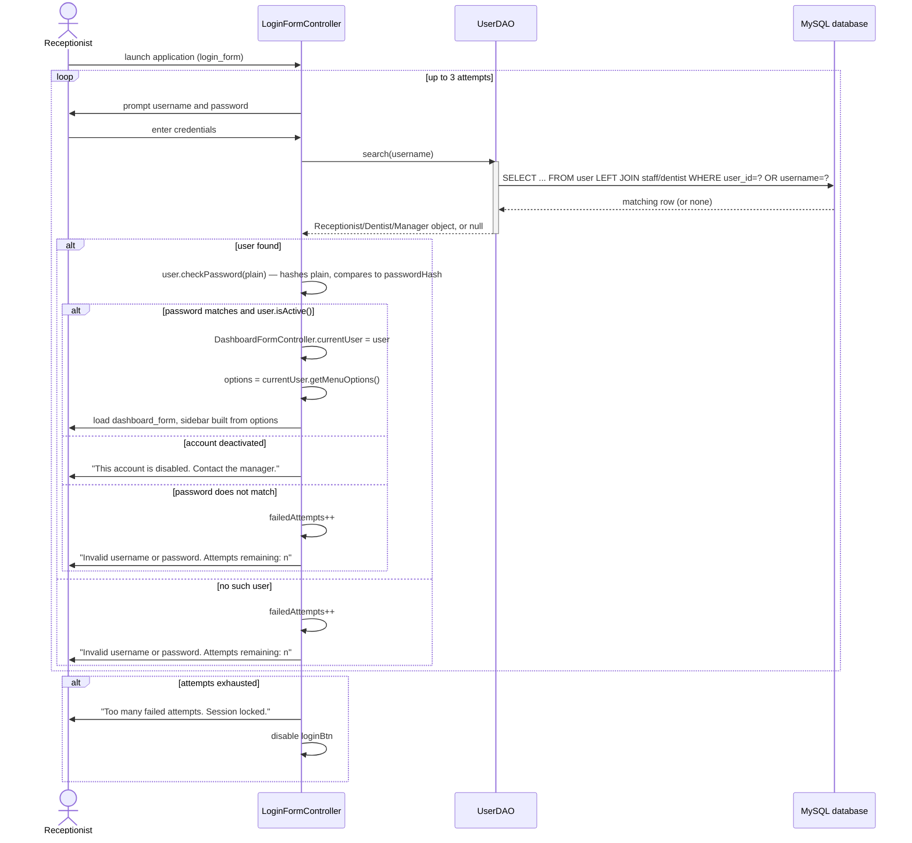
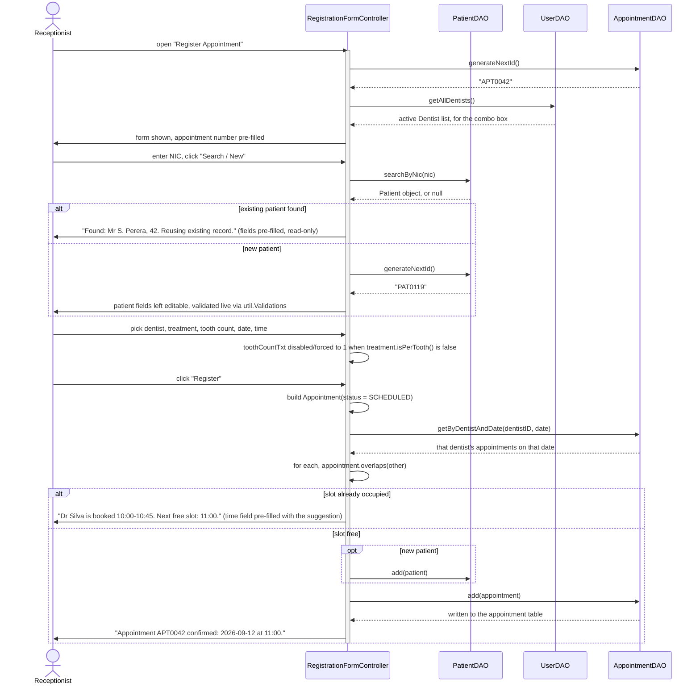
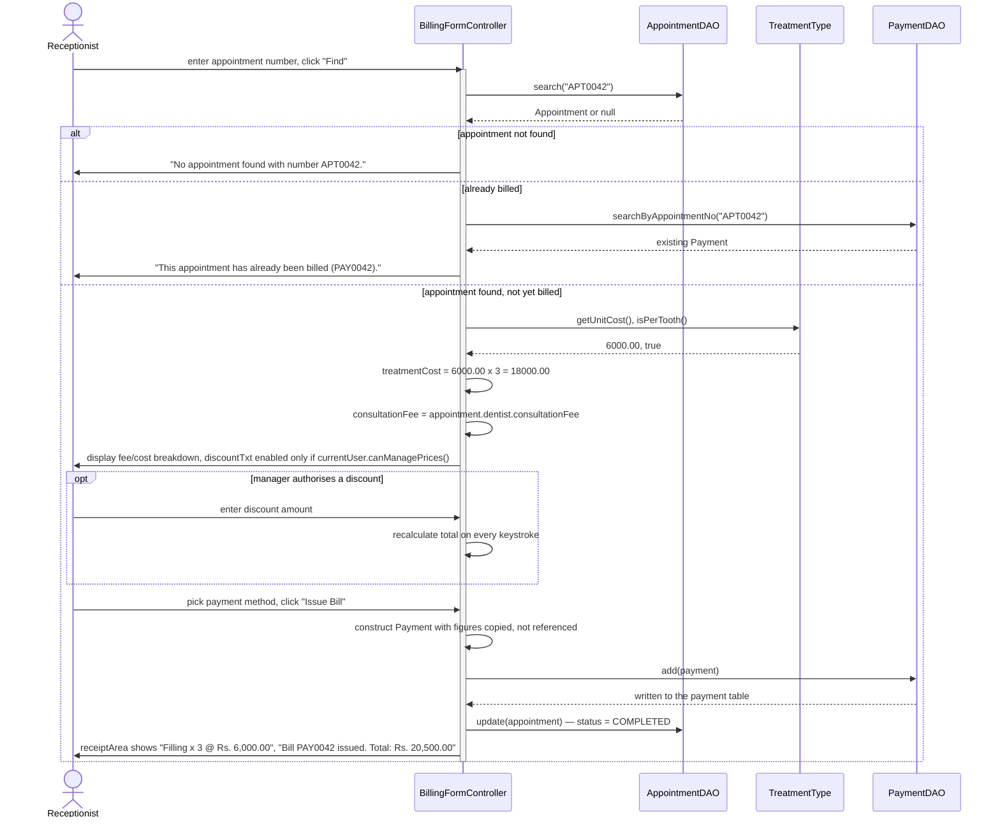
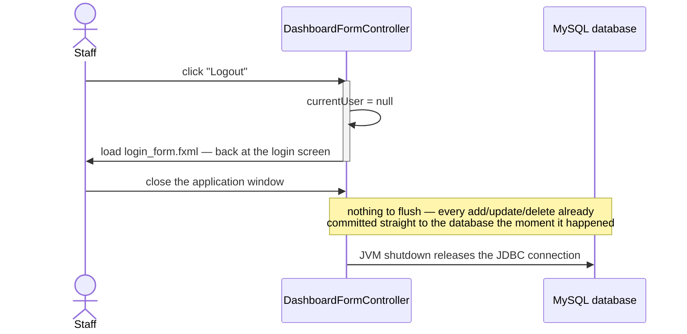

# Sequence Diagrams

Sunrise Dental Clinic — Appointment and Patient Management System

There are four scenarios here. The first three are the core functions the brief
actually asks for — logging in, booking an appointment, and billing. The fourth
is logging out and closing the application; it's a much lighter diagram than
in a text-file design, precisely because every operation already commits
straight through JDBC as it happens rather than waiting to be flushed on exit.

---

## 1. Figure 3a — User authentication

**Design notes.** Passwords get compared as hashes (`User.checkPassword`
delegates to `util.PasswordUtil`), so the `user` table never has a readable
password sitting in it. The attempt counter is a static field on
`LoginFormController` rather than something enforced in the FXML itself — it
persists across login attempts within the same run of the application. Three
attempts is a guess on our part, but it feels right given the terminal sits
out in a public waiting area. The menu itself comes from
`currentUser.getMenuOptions()`, so a receptionist simply never sees options
they're not allowed to touch, which beats showing the option and then telling
them no afterwards. There's no separate `AuthService`/`UserRepository` pair —
`UserDAO` does the lookup (joining `staff`/`dentist` depending on role) and
the `User` subclass itself does the password check and menu-building, which
is the same "push behaviour onto the model instead of a service layer" choice
described in ClassDiagram.md §3.

---

## 2. Figure 3b — Register new appointment with clash detection

**Design notes.** The clash check happens before anything gets written, so a
booking that gets rejected never leaves a half-written record behind. Slot
length is duration times tooth count, not just duration on its own — three
fillings take three times as long in the chair, and if that wasn't accounted
for, overlapping bookings would just creep back in, which is exactly what this
whole check is meant to stop. `Appointment.overlaps()` only returns true when
both appointments' `status.blocksSlot()` holds, so a cancelled booking frees
its slot up on its own without the controller having to special-case it.
Suggesting the next free slot instead of just saying "no" is a usability call
— the receptionist has a patient standing at the counter and needs something
to offer right away, not another search to run. There's no `AppointmentService`
in between — `RegistrationFormController` calls `AppointmentDAO` directly and
asks the `Appointment` model object itself whether it overlaps, per the same
"model absorbs the business rule" choice as clash detection has always used
in ClassDiagram.md.

---

## 3. Figure 3c — Calculate and print bill

**Design notes.** `BillingFormController` gets the unit cost and per-tooth flag
from the `TreatmentType` enum itself rather than letting someone type a figure
in, which is really the whole point — that manual typing is what caused the
clinic's billing errors in the first place. The figures get copied into
`Payment` rather than just referenced, so reprinting an old receipt after a
price change still shows what the patient actually paid at the time. The
receipt prints the full breakdown instead of just a total, since a patient who
questions a charge needs to see how it was arrived at, not just be told a
number. The discount field's `disable` is bound to
`currentUser.canManagePrices()` rather than just a runtime check on submit —
a receptionist should never see it as editable in the first place, not be
allowed to type into it and get corrected afterwards. There's no separate
`BillingService` object; the controller builds the `Payment` itself and asks
`Payment.getTotalAmount()` to do the arithmetic, the same "model, not service"
shape used everywhere else in this design.

---

## 4. Figure 3d — Logout and close application

**Design notes.** This scenario used to be the moment everything held in
memory finally got written to disk, which made it the single point where a
whole session's data was most likely to be lost — hence the original design's
"Save changes and exit? (Y/N)" confirmation. Once every screen commits its own
change straight through JDBC as it happens (Assumption #7), that risk simply
isn't there any more: there's nothing sitting unsaved for "Exit" to lose, so
the confirmation prompt would just be friction with nothing behind it. What's
left worth diagramming is logout — clearing `DashboardFormController.currentUser`
and returning to `login_form` — which is also the reset point for
`LoginFormController`'s attempt counter on the next person who sits down at
the terminal.

---

## 5. Design decisions common to all four diagrams

**Every participant gets activation bars.** You can see from the lifelines
that the controller stays active through the whole interaction while each DAO
only lights up for as long as a query takes. That's really just showing on the
page what the class diagram already argues — control always comes back to the
controller/view layer in the end, since there's no service layer for it to
sit inside.

**Validation shows up as field-level colouring via `util.Validations`, not as
if/else logic buried inside the controller.** `Validations.setFocus` is called
once per field in each `initialize()`, so the input rules live in one regex
table instead of being copy-pasted onto every screen. It's a different
mechanism from the original console design's `InputValidator` (which prompted
and re-prompted one field at a time) because a JavaFX form presents every
field at once and validates continuously as the user types, but the underlying
principle — one place owns the rules — is the same.

**Every single diagram has at least one failure path in it.** The brief wants
an "error free, effective" application with "appropriate messages" in it, and
you can't really show that with happy-path-only diagrams. Each `alt` fragment
uses the actual wording the user would see in an `Alert`, so these diagrams
end up doubling as a spec for what the interface should say.

**DAOs show up as participants everywhere, but the database itself only
appears in Figure 3a.** Once it's shown that a DAO reads and writes through
`DBConnection`, there's no need to redraw that database lifeline in every
other diagram — it would just take up space without saying anything new.

**Replies use dashed arrows and say what's being returned, not the method
name.** Makes it easy to tell a reply from a call at a glance, which actually
matters in Figure 3b since the same participant gets called more than once in
a row there.

---

## 6. Assumptions relevant to these diagrams

| # | Assumption | Why |
|---|---|---|
| 1 | Three failed login attempts locks the session | The terminal sits out in a public waiting area |
| 2 | The main menu depends on who's logged in | Showing an option and then refusing it is worse than never showing it |
| 3 | Cancelled and no-show appointments don't hold onto their time slot | Otherwise a cancelled booking permanently eats into the schedule for no reason |
| 4 | The system offers the next free slot when there's a clash | The receptionist is talking to a patient right there and needs an answer immediately |
| 5 | Every add/update/delete commits straight through JDBC, not batched at exit | A crash then only costs the one operation in progress instead of the whole session |
| 6 | Logging out clears `currentUser` and resets the login attempt counter's context | Stops the next person at the terminal from starting inside someone else's session |
| 7 | A failed database operation gets shown to the user, not just logged quietly | The staff member is the only one around who can actually do something about it |
| 8 | Tooth count isn't asked for on treatments that aren't per-tooth | No point asking a question that means nothing for a scaling appointment — it just invites mistakes |

---

## 7. Figure captions for the report

> **Figure 3a** — User authentication: hash comparison, the attempt limit
> enforced on `LoginFormController`, and the menu being built around the
> user's role.

> **Figure 3b** — Appointment registration: reusing an existing patient
> record, clash detection that accounts for treatment duration, and what
> happens when the requested slot isn't free.

> **Figure 3c** — Bill calculation and receipt printing: per-tooth cost
> worked out from the `TreatmentType` enum, plus the optional
> manager-authorised discount.

> **Figure 3d** — Logout and close application: clearing the session on
> logout, and why closing the window no longer needs a save confirmation now
> that every change already commits through JDBC as it happens.
